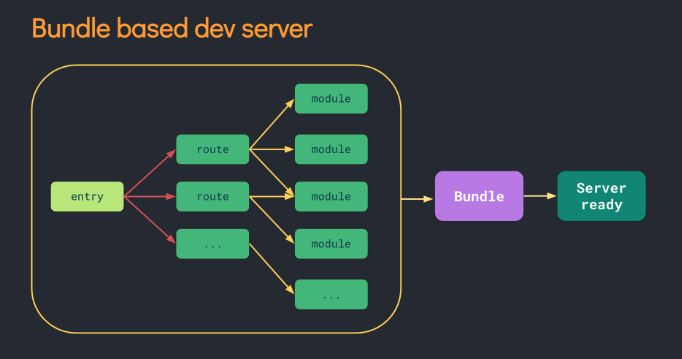
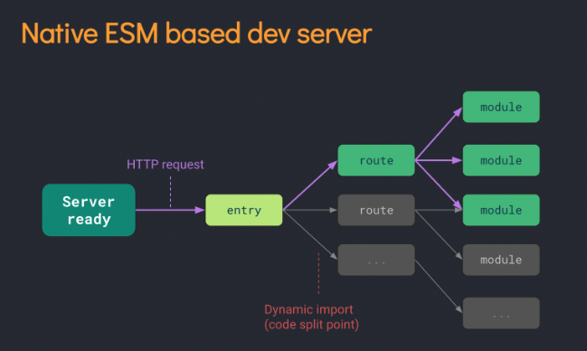
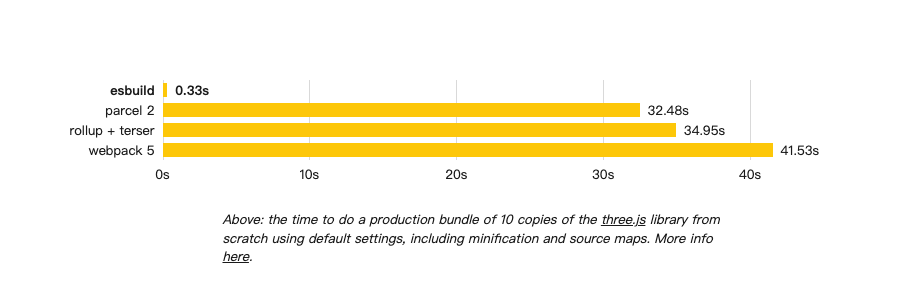
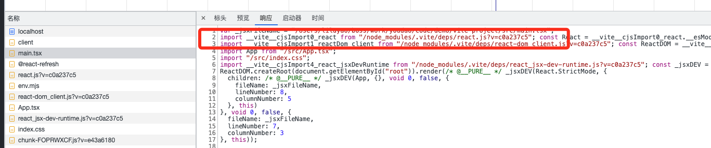
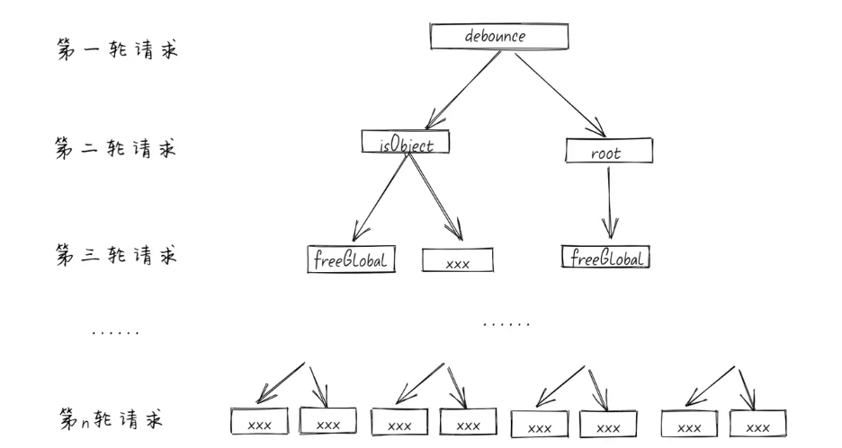
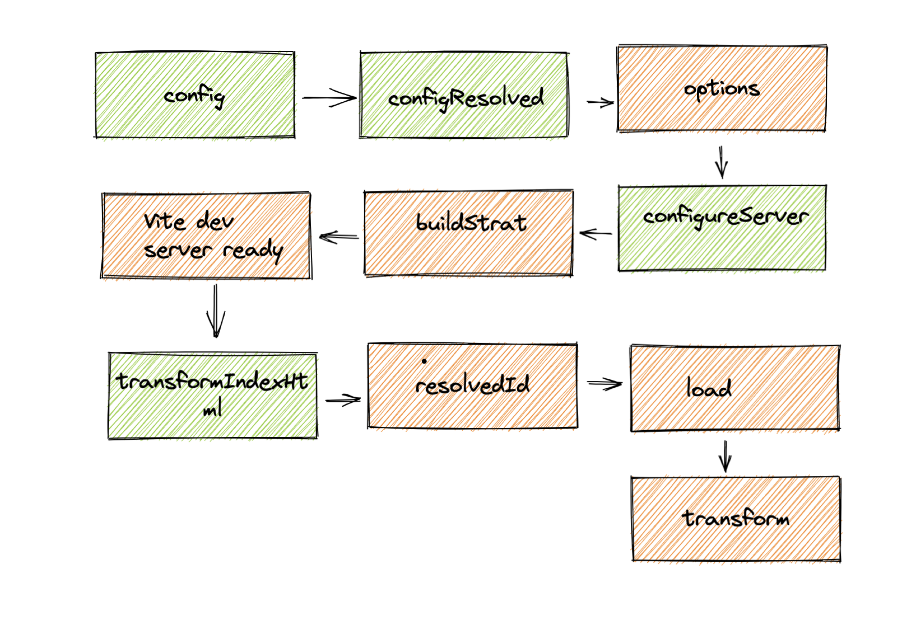

# vite 下一代前端开发与构建工具

[TOC]


## vite是什么

Vite是一种新型的前端构建工具，是尤雨溪在开发Vue3.0的时候诞生的。类似于`webpack+webpack-dev-server`。利用浏览器`ESM`特性导入组织代码，在服务端按需编译返回，完全跳过了打包这个概念；而生产环境则是利用`Rollup`作为打包工具，号称是下一代的前端构建工具。

* `极速的服务启动`使用原生的ESM文件，无需打包
* `轻量快速的热重载`无论应用程序大小如何，都始终极快的模块热重载（HMR）
* `丰富的功能`对 TypeScript、JSX、CSS 等支持开箱即用。
* `优化的构建`可选 “多页应用” 或 “库” 模式的预配置 Rollup 构建
* `通用的插件`在开发和构建之间共享 Rollup-superset 插件接口。
* `完全类型化的API`灵活的 API 和完整的 TypeScript 类型。

## 我们为什么需要vite

传统的打包工具如`Webpack`是先解析依赖、打包构建再启动开发服务器，`Dev Server` 必须等待所有模块构建完成，当我们修改了 `bundle`模块中的一个子模块， 整个 `bundle` 文件都会重新打包然后输出。项目应用越大，启动时间越长。



## vite是怎么做的

Vite 通过在一开始将应用中的模块区分为 **依赖** 和 **源码** 两类，改进了开发服务器启动时间。

- **依赖** 大多为在开发时不会变动的纯 JavaScript。一些较大的依赖（例如有上百个模块的组件库）处理的代价也很高。依赖也通常会存在多种模块化格式（例如 ESM 或者 CommonJS）。

  Vite 将会使用 [esbuild](https://esbuild.github.io/) [预构建依赖](https://cn.vitejs.dev/guide/dep-pre-bundling.html)（处理CommonJs和UMD兼容性、合并http请求性能优化）。esbuild 使用 Go 编写，并且比以 JavaScript 编写的打包器预构建依赖快 10-100 倍。

- **源码** 通常包含一些并非直接是 JavaScript 的文件，需要转换（例如 JSX，CSS 或者 Vue/Svelte 组件），时常会被编辑。同时，并不是所有的源码都需要同时被加载（例如基于路由拆分的代码模块）。

Vite 以 [原生 ESM](https://developer.mozilla.org/en-US/docs/Web/JavaScript/Guide/Modules) 方式提供源码。这实际上是让浏览器接管了打包程序的部分工作：Vite 只需要在浏览器请求源码时进行转换并按需提供源码。根据情景动态导入代码，即只在当前屏幕上实际使用时才会被处理。





## 前置知识


### ESM

在了解Vite之前，需要先了解下ESM，不同于之前的CJS，AMD，CMD等等，ESM提供了更原生以及更动态的模块加载方案，最重要的就是它是浏览器原生支持的，也就是说我们可以直接在浏览器中去执行import，动态引入我们需要的模块，而不是把所有模块打包在一起。


`使用方式`

```html
<script type="module">
  import message from './message.js'
  console.log(message) // hello world
</script>
```

也就是说 浏览器可以通过 `<script type="module">` 的方式和 `import` 的方式加载标准的 ES 模块 


而且 模块`只会执行一次`并且默认为defer也支持async


传统的`<script>`如果引入的JS文件地址是一样的，则JS会执行多次。但是，对于`type="module"`的`<script>`元素，即使模块地址一模一样，也只会执行一次。例如：

```html
<!-- 1.mjs只会执行一次 -->
<script type="module" src="1.mjs"></script>
<script type="module" src="1.mjs"></script>
<script type="module">import "./1.mjs";</script>
<!-- 下面传统JS引入会执行2次 -->
<script src="2.js"></script>
<script src="2.js"></script>
```

### esbuild

Vite底层使用Esbuild实现对`.ts、jsx、.js`代码文件的转化，所以先看下什么是es-build。


esbuild 号称是新一代的打包工具，提供了与`Webpack`、`Rollup`、`Parcel` 等工具相似的资源打包能力，但在时速上达到10～100倍的差距，耗时是`Webpack`2%~3%

这是`Esbuild`首页的对比图。



`为啥这么快`


大多数前端打包工具都是基于 `JavaScript` 实现的，大家都知道`JavaScript`是解释型语言，边运行边解释。而 `Esbuild` 则选择使用 `Go` 语言编写，该语言可以编译为原生代码,在编译的时候都将语言转为机器语言，在启动的时候直接执行即可，在 `CPU` 密集场景下，`Go` 更具性能优势。


### roolup

在生产环境下，Vite使用`Rollup`来进行打包


`Rollup`是基于`ESM`的JavaScript打包工具。它将小文件打包成一个大文件或者更复杂的库和应用，打包既可用于浏览器和Node.js使用。 Rollup最显著的地方就是能让打包文件体积很小。相比其他JavaScript打包工具，Rollup总能打出更小，更快的包。因为`Rollup`基于`ESM`，比Webpack和Browserify使用的CommonJS模块机制更高效。


## vite原理

我们先看下vite在项目中的工作方式 拿一个demo项目来举例子

```js
// index.html
 <body>
    <div id="root"></div>
    <script type="module" src="/src/main.tsx"></script>
 </body>

// main.tsx
import React from 'react'
import ReactDOM from 'react-dom/client'
import App from './App'
import './index.css'

ReactDOM.createRoot(document.getElementById('root')!).render(
  <React.StrictMode>
    <App />
  </React.StrictMode>
)
```


项目中分类两种依赖 

1. `/srx/main.tsx`相对地址的源码 
2. `import React from 'react'`非相对地址的依赖模块

第二种`ESM`是不支持的 `import` 对应的路径只支持 `"/""./"`或者 `"../"` 开头的内容，直接使用模块名 `import`，会立即报错。 那vite的这么处理的呢 我们来看下请求





`react`被替换成了 `/node_modules/.vite/deps/react.js?v=c0a237c5`


### 这就是vite的核心原理: 

`Vite`启动一个服务器拦截请求，并在后端进行相应的处理将项目中使用的文件通过简单的分解与整合，然后再以`ESM`格式返回返回给浏览器。

### 实现一个简易的 vite

```js
// 项目中安装依赖 然后 `yarn dev:demo` 可以看效果

const Koa = require('koa')
const app = new Koa()

const opn = require('opn');
const fs = require("fs")
const path = require("path")
const complierSFC = require('@vue/compiler-sfc') //引入vue文件的解析
const complierDOM = require('@vue/compiler-dom') //引入template的解析

// 中间件配置
// 处理路由
app.use(async (ctx) => {
  const {
    url,
    query
  } = ctx.request

  // 首页请求
  if (url === '/') {
    //加载index.html
    ctx.type = "text/html";
    ctx.body = fs.readFileSync(path.join(__dirname, "./index.html"), "utf8");
  } else if (url.endsWith('.js')) {
    // js文件加载处理
    const p = path.join(__dirname, url)
    ctx.type = 'application/javascript'
    ctx.body = rewriteImport(fs.readFileSync(p, 'utf8'))
  } else if (url.startsWith("/@modules/")) {
    //裸模块名称
    const moduleName = url.replace("/@modules/", "");
    //去node_modules目录中找
    const prefix = path.join(__dirname, "../node_modules", moduleName);
    //package.json中获取module字段
    const module = require(prefix + "/package.json").module;
    const filePath = path.join(prefix, module);
    const ret = fs.readFileSync(filePath, "utf8");
    ctx.type = 'application/javascript'
    ctx.body = rewriteImport(ret)
  } else if (url.indexOf('.vue') > -1) {
    //获取加载文件路径
    const p = path.join(__dirname, url.split("?")[0]);
    const ret = complierSFC.parse(fs.readFileSync(p, 'utf8')); // console.log(ret)  可以看到是一颗ast树，可以在终端中查看
    if (!query.type) {
      //SFC请求，读取vue文件，解析为js
      //获取脚本部分的内容
      const scriptContent = ret.descriptor.script.content;
      //替换默认导出为一个常量，方便后续修改
      const script = scriptContent.replace(
        "export default ",
        "const __script = "
      );
      ctx.type = 'application/javascript'
      ctx.body = `
        ${rewriteImport(script)}
        // 解析template
        import {render as __render} from '${url}?type=template'
        __script.render = __render
        export default __script
        `;
    } else if (query.type === "template") {
      const tpl = ret.descriptor.template.content;
      //编译为render
      const render = complierDOM.compile(tpl, {
        mode: "module"
      }).code;
      ctx.type = 'application/javascript'
      ctx.body = rewriteImport(render)
    }
  }
})

// 裸模块地址的重写
//在vite中对于vue这种裸模块是无法识别的，它通过预编译把需要的模块打包到node_modules中，再通过相对地址找到并加载，
//这里我们通过识别 /@modules 这种地址标识，去找寻模块，进行地址的替换
//import xx from "vue"  ==> import xx from "/@modules/vue"
function rewriteImport(content) {
  return content.replace(/ from ['"](.*)['"]/g, function (s1, s2) {
    if (s2.startsWith("./") || s2.startsWith("/") || s2.startsWith("../")) {
      return s1
    } else {
      //裸模块替换
      return ` from '/@modules/${s2}'`
    }
  })
}

app.listen(3000, () => {
  console.log('kvite start');
  opn(`http://localhost:3000/`);
})
```


### 总结一下就是:

首先启动一个服务器，对首页(index.html)、js文件、裸模块比如"vue"、vue文件等进行分别处理


1. 先返回`index.html`,然后再index.html中去加载`main.js`,在main.js中再去加载其它文件

2. 加载main.js中的`裸模块`，比如"vue",vite会通过预打包，将vue模块的内容打包到node_modules中，然后替换路径，

```js
import {createApp} from 'vue'

import {createApp} from '/@modules/vue'
```


通过 /@modules标识去node_module中查找并返回相对地址

3. 加载vue文件，当Vite遇到一个.vue后缀的文件时。由于.vue模板文件的特殊性，它被分割成template，css，脚本模块三个模块进行分别处理。最后放入script，template，css发送多个请求获取。

vite遇到.vue后缀时，会使用vue中的compiler方法进行解析并返回


文件的执行顺序：

localhost ==》 client(websocket) ==> main.js ==> env.js ==> vue.js(裸模块vue) ==> app.vue ==> 最后就是执行里面的路由，组件，ui库等


`为啥需要预编译`


依赖预编译，其实是 Vite 2.0 在为用户启动开发服务器之前，先用 `esbuild` 把检测到的依赖预先构建了一遍。

也许你会疑惑，不是一直说好的 no-bundle 吗，怎么还是走启动时编译这条路线了？

以导入 `lodash-es` 这个包为例。当你用 `import { debounce } from 'lodash'` 导入一个命名函数的时候，

可能你理想中的场景就是浏览器去下载只包含这个函数的文件。但其实没那么理想，`debounce` 函数的模块内部又依赖了很多其他函数，形成了一个依赖图。

当浏览器请求 `debounce` 的模块时，又会发现内部有 2 个 `import`，再这样延伸下去，这个函数内部竟然带来了 600 次请求，耗时会在 1s 左右。





再有就是去做模块化的兼容，对 `CommonJS` 模块进行分析，方便后面需要统一处理成浏览器可以执行的 `ES Module`。

## vite插件

使用Vite插件可以扩展Vite能力，比如解析用户自定义的文件输入，在打包代码前转译代码，或者查找第三方模块。

### 插件的形式

`Vite`插件扩展自`Rollup`插件接口，只是额外多了一些`Vite`特有选项。

`Vite`插件是一个**拥有名称**、**创建钩子**(build hook)或**生成钩子**(output generate hook)**的对象**。

```js
export default {
    name: 'demo-plugin',
  	resolveId(id) {},
  	load(id){},
  	transform(code) {}
}

export default function (options) {
  return {
    name: 'demo-plugin',
  	resolveId(id) {},
  	load(id){},
  	transform(code) {}
  }
}
```

开发时，`Vite dev server`创建一个插件容器按照`Rollup`调用创建钩子的规则请求各个钩子函数。

### 通用钩子-rollup中的

下面钩子会在服务器启动时调用一次:

- [`options`](https://link.juejin.cn?target=https%3A%2F%2Frollupjs.org%2Fguide%2Fen%2F%23options) 替换或操纵`rollup`选项
- [`buildStart`](https://link.juejin.cn?target=https%3A%2F%2Frollupjs.org%2Fguide%2Fen%2F%23buildstart) 开始创建

下面钩子每次有模块请求时都会被调用:

- [`resolveId`](https://link.juejin.cn?target=https%3A%2F%2Frollupjs.org%2Fguide%2Fen%2F%23resolveid) 创建自定义确认函数，常用于定位第三方依赖
- [`load`](https://link.juejin.cn?target=https%3A%2F%2Frollupjs.org%2Fguide%2Fen%2F%23load) 创建自定义加载函数，可用于返回自定义的内容
- [`transform`](https://link.juejin.cn?target=https%3A%2F%2Frollupjs.org%2Fguide%2Fen%2F%23transform) 可用于转换已加载的模块内容

下面钩子会在服务器关闭时调用一次:

- [`buildEnd`](https://link.juejin.cn?target=https%3A%2F%2Frollupjs.org%2Fguide%2Fen%2F%23buildend)
- [`closeBundle`](https://link.juejin.cn?target=https%3A%2F%2Frollupjs.org%2Fguide%2Fen%2F%23closebundle)

### vite特有钩子

- config: 修改Vite配置
- configResolved：Vite配置确认
- configureServer：用于配置dev server
- transformIndexHtml：用于转换宿主页
- handleHotUpdate：自定义HMR更新时调用

### 插件的执行顺序

一个 Vite 插件可以额外指定一个 enforce 属性（类似于 webpack 加载器）来调整它的应用顺序。enforce 的值可以是pre 或 post。解析后的插件将按照以下顺序排列：
  1. Alias
  2. 带有 enforce: 'pre' 的用户插件
  3. Vite 核心插件
  4. 没有 enforce 值的用户插件
  5. Vite 构建用的插件
	6.  带有 enforce: 'post' 的用户插件
  7. Vite 后置构建插件（最小化，manifest，报告）

### 插件介绍：

```js

export default function demoPlugin () {
  // 定义vite插件唯一id
  const virtualFileId = '@demo-plugin'
  // 返回插件对象
  return {
    // 必须的，将会显示在 warning 和 error 中
    name: 'vite-plugin',

    // *以下钩子函数按照实际执行顺序排列*

    /**
     * config 可以在被解析之前修改 Vite 配置
     * Vite独有钩子
     * https://cn.vitejs.dev/guide/api-plugin.html#config
     * @param config vite配置信息
     * @param env 描述配置环境的变量
     */
    config: (config, env) => ({}),

    /**
     * configResolved 解析 Vite 配置后调用,使用这个钩子读取和存储最终解析的配置
     * Vite独有钩子
     * https://cn.vitejs.dev/guide/api-plugin.html#configresolved
     * @param config vite配置信息
     */
    configResolved: config => ({}),

    /**
     * options 替换或操作传递给rollup.rollup()的选项
     * 通用钩子
     * https://rollupjs.org/guide/en/#options
     * @param options rollup配置信息
     */
    options: options => ({}),

    /**
     * configureServer 用于配置开发服务器
     * Vite独有钩子
     * https://cn.vitejs.dev/guide/api-plugin.html#configureserver
     * @param server ViteDevServer配置信息
     * https://cn.vitejs.dev/guide/api-javascript.html#vitedevserver
     */
    configureServer: server => ({}),

    /**
     * buildStart 在每个rollup.rollup()构建时被调用
     * 通用钩子
     * https://rollupjs.org/guide/en/#buildstart
     * @param options rollup配置信息
     */
    buildStart: options => ({}),

    /**
     * 此时 Vite dev server is running
     */

    /**
     * transformIndexHtml 转换 index.html 的专用钩子
     * Vite独有钩子
     * https://cn.vitejs.dev/guide/api-plugin.html#transformindexhtml
     * @param html html字符串
     * @param ctx 转换上下文; 在开发期间会额外暴露ViteDevServer实例; 在构建期间会额外暴露Rollup输出的包
     */
    transformIndexHtml: (html, ctx) => ({}),

    /**
     * resolveId 用户自定义解析器
     * 通用钩子 会在每个传入模块请求时被调用
     * https://rollupjs.org/guide/en/#resolveid
     * @param source 源导入者 例子: import { foo } from '../bar.js', '../bar.js' 为source
     * @param importer 导入者所在文件绝对路径
     */
    resolveId: (source, importer) => ({}),

    /**
     * load 用户自定义加载器
     * 通用钩子 会在每个传入模块请求时被调用
     * https://rollupjs.org/guide/en/#load
     * @param id 同resolveId source
     */
    load: id => ({}),

    /**
     * transform 可以用来转换单个模块
     * 通用钩子 会在每个传入模块请求时被调用
     * https://rollupjs.org/guide/en/#transform
     * @param code 模块代码
     * @param id 同resolveId source
     */
    transform: (code, id) => ({})

  }
}

```


### 插件的执行顺序




### 举例子 🌰

#### [vite-plugin-env-command](https://github.com/yaocoding007/vite-plugin-env-command)

```typescript
/**
 * 
 * @param options?: {defaultEnv = 'dev', key = 'APP_ENV'}} 
 * @returns 
 */
export default function CommandSetEnv(options: Options) {
    const { defaultEnv = 'dev', key = 'APP_ENV' } = options;
    const commandArgs = getCommandArgv() || defaultEnv;

    return {
        name: 'vite-plugin-env-command',
        config: () => ({
            define: {
                'process.env': JSON.stringify({
                    [key]: commandArgs
                }),
            }
        })
    }
}
```

#### [vite-plugin-vconsole](https://github.com/vadxq/vite-plugin-vconsole)

```js
export function viteVConsole(opt: viteVConsoleOptions): Plugin {
  let viteConfig: ResolvedConfig;
  return {
    name: 'vite:vconsole',
    enforce: 'pre',
    configResolved(resolvedConfig) {
      viteConfig = resolvedConfig;
      isDev = viteConfig.command === 'serve';
    },
    transform(_source: string, id: string) {
      if (entryPath.includes(id) && localEnabled && isDev) {
        // serve dev
        return `/* eslint-disable */;import VConsole from 'vconsole';new VConsole(${JSON.stringify(
          config
        )});/* eslint-enable */${_source}`;
      }
      if (entryPath.includes(id) && enabled && !isDev) {
        // build prod
        return `/* eslint-disable */;import VConsole from 'vconsole';new VConsole(${JSON.stringify(
          config
        )});/* eslint-enable */${_source}`;
      }
      return _source;
    }
  };
}
```

## vite 学习的项目

* /demo/ vite 核心原理的实现 执行 `yarn dev:demo` 可以看效果
* /vite-plugin/ 简单的几个vite插件的源码
* /demo-plugin.js 插件的执行顺序测试


## 参考文献

[vite-plugin-env-command](https://github.com/yaocoding007/vite-plugin-env-command)

[vite-plugin-vconsole](https://github.com/vadxq/vite-plugin-vconsole)

[https://github.com/upJiang/kvite](https://github.com/upJiang/kvite)
